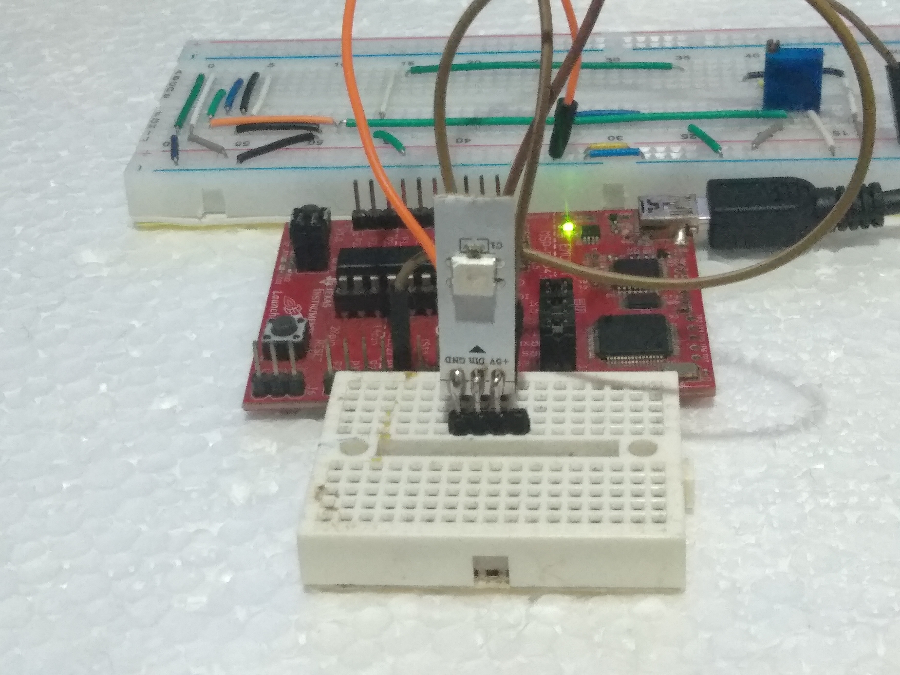
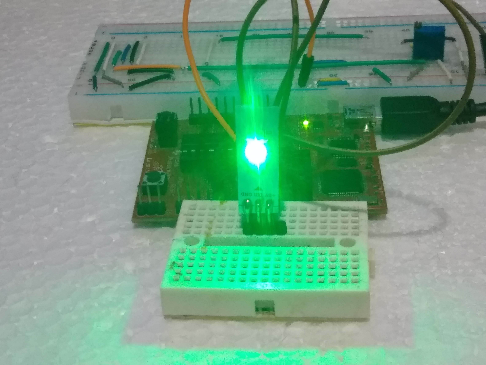
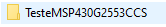
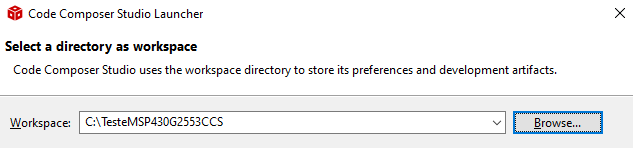
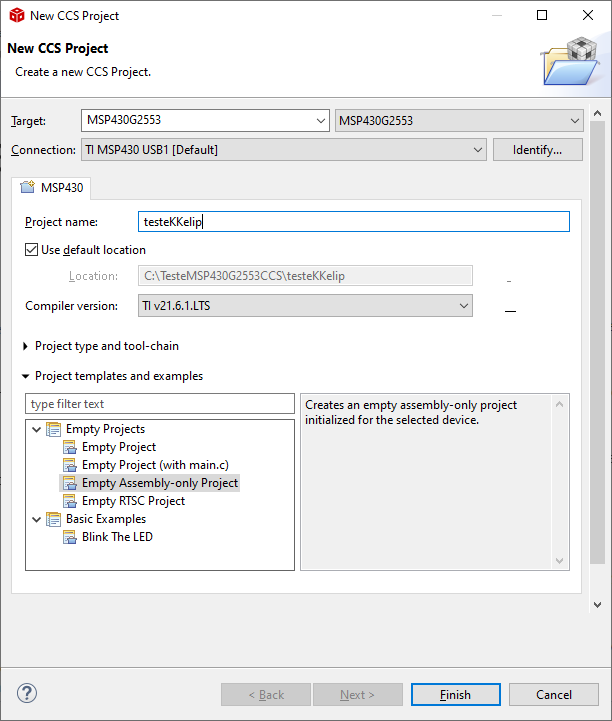
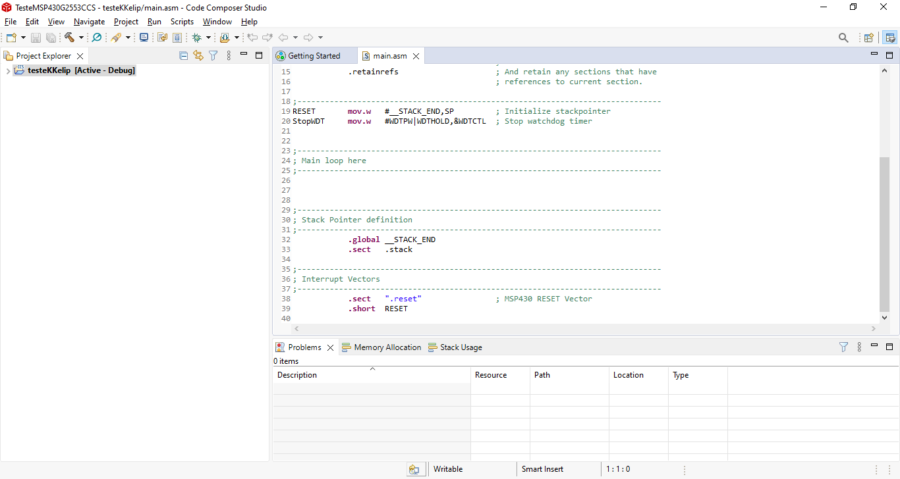
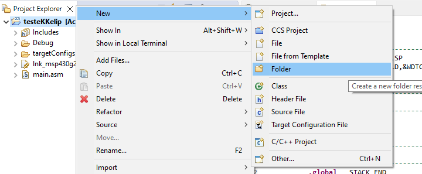
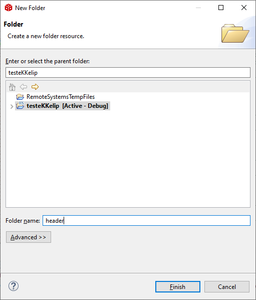

# kkelipCore



Este projeto é um  laboratório que tem como principal objetivo compreender o funcionamento dos LEDS Endereçaveis. Que a partir de um Microcontrolador **MSP430G2553**, irá gerenciar e exibir por protocolo WS2812 as cores visiveis do espectro.


## Observação


**É necessário entender o funcionamento da Placa Experimental da Texas Instruments. Compreender como carregar um Firmware e utilizar suas configurações básicas na IDE da sua escolha. Esse material não disponibiliza essa informação de maneira completa.**

## Fase 1

O projeto encontra-se em fase inicial, onde o Firmware esta em execução somente na Experimenter Board. Apenas a **Cor Verde** pode ser visualizado na execução, sem nenhuma abordagem no código fonte. Para exibir outras cores no **LED**, será necessário alterar os respectivos bytes na linha 382 do código original.



### Rotinas importantes - Fase 1

As rotinas de maior importância nessa fase são respectivamente:

* INIT_SPI_COMM
* SS_STRP

Nessa solução temos apenas um LED, então a chamada que irá executar o led. Pode ser visto a seguir:

📃 **main.asm**
````
mov.b    #001H,&QT_LED_N
call     #INIT_SPI_COMM
call     #SS_STRP
````

A movimentação do byte **0x01**, **mov.b    #001H,&QT_LED_N** . Configura o firmware para executar apenas um LED. 

Ao inicializar o firmware, uma chamada de rotina **LOAD_LEDS_INPUT_RGB** é executada. Essa chamada carrega todo o conteúdo do bloco **Dados Fixos**:

📃 **main.asm**

````
;----------------------------------------------------------------------------------------------
;                                  DADOS FIXOS
;----------------------------------------------------------------------------------------------
;                                |G    |R   |B
;----------------------------------------------------------------------------------------------
LED_CC_COLOR_DEFAULT    .byte    080H, 000H, 000H  ; Verde
;----------------------------------------------------------------------------------------------
````

Esses dados após esse processamento estarão disponíveis na memória SRAM do dispositivo, que esta mapeado no arquivo header **(kkelipCoreH.h)**.

📃 **kkelipCoreH.h**

````
/* BARRA DE CONTROLE E GERENCIAMENTO DOS LEDS       */
#define    CTRL_LED_I_COLOR_RED                 00290H
#define    CTRL_LED_1_COLOR_GREEN               00291H
#define    CTRL_LED_1_COLOR_BLUE                00292H
#define    CTRL_LED_2_COLOR_RED                 00293H
#define    CTRL_LED_2_COLOR_GREEN               00294H
#define    CTRL_LED_2_COLOR_BLUE                00295H
#define    CTRL_LED_3_COLOR_RED                 00296H
#define    CTRL_LED_3_COLOR_GREEN               00297H
#define    CTRL_LED_3_COLOR_BLUE                00298H
#define    CTRL_LED_4_COLOR_RED                 00299H
#define    CTRL_LED_4_COLOR_GREEN               0029AH
#define    CTRL_LED_4_COLOR_BLUE                0029BH

````

### Como testar?

### 💻 Hardware

Os experimentos dessa versão, utiliza uma placa experimental da Texas Instruments, **MSP-EXP430G2**. Uma fonte com regulador de tensão, configurado para fornecer 5v. A fonte, deverá alimentar somente o LED. A placa experimental vai ligada no USB do PC, que já possui um circuito que regula a tensão nos níveis do MSP430 que trabalha com 3.3v.

O LED do experimento foi subtraído de uma Fita de LED, de modo que somente um led possa ser configurado.

👉 **As ligações** 

<table>
   <tr>
      <td style="text-align: center;">MSP-EXP430G2</td><td style="text-align: center;">LED</td><td style="text-align: center;">Fonte de Alimentação</td>
   </tr>
   <tr>
      <td style="text-align: center;">P1.7</td><td>DIN</td><td style="text-align: center;">ND</td> 
   </tr>
   <tr>
    <td style="text-align: center;">ND</td><td style="text-align: center;">VCC</td><td style="text-align: center;">5v+</td>
   </tr>
   <tr>
   <td style="text-align: center;">GND</td><td style="text-align: center;">GND</td><td style="text-align: center;">5v-</td>
   </tr>
</table>

### 🖱️ Firmware

Em meu laboratório estou trabalhando nesse projeto, utilizando o **Code Composer Studio v12.4.0**. Sempre trabalhei com o IAR. Mas para esses novos projetos, ponderei pela mudança. O **CCS**, como é chamado, tem uma interface melhor e recursos mais interessantes. 

👉 **Fica portanto ao critério do leitor qual IDE utilizar** 

#### Testando no Code Composer Studio

Crie em C, ou em um diretório de sua preferência, um diretório para criação de sua Workspace. Utilize como sugerido logo abaixo.



Lembrando que a criação desse diretório é de sua escolha, não interferindo no funcionamento do firmware.

#### ⚒️ Executando o CCS

Ao executar o CCS, será necessário definir uma Workspace. Nessa demonstração, será utilizado o **TesteMSP430G2553CCS**.



#### ⚒️ Iniciando um Projeto


#### ⚒️ Configuração inicial do Projeto



Exceto o nome informado **testeKKelip**, todos os parâmetros devem obedecer a configuração proposta. O nome do projeto é de sua escolha.

#### ⚒️ Abrindo main.asm 



Nesse momento sua IDE lhe proporciona todo um ambiente pronto para codificar e depurar seu firmware. Para executar o exemplo proposto aqui. Será necessário criar o diretório **header** na raiz do projeto, no mesmo nível do arquivo **main.asm**.







Adicione o arquivo **kkelipCoreH.h** no diretório **header**. Após criar o diretório header e adicionar o arquivo .h, como proposto. Substitua o conteúdo **main.asm**, pelo conteúdo do **main.asm** do **kkelipCore**.

Com as configurações aplicadas e o código fonte adicionado. Execute o **Build**, em seguida o **Debug**, caso não exista nenhum erro. 

#### Documentação

No diretório doc, está disponível a documentação do protocolo **WS2812B**, para um melhor entendimento.
